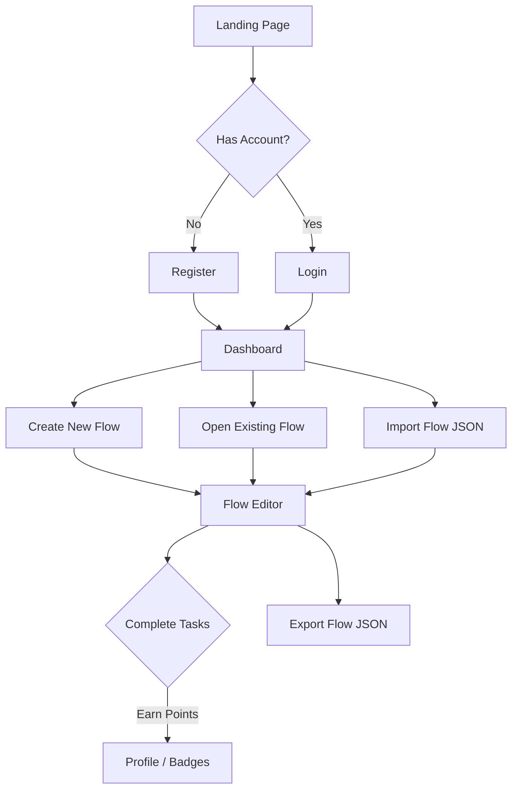

# The Existential Choreography Planner - Specification Sheet

## Project Vision
A gamified task management app where users transform mundane chores into dramatic, over-engineered "Choreography Flowcharts." Users spend energy to complete tasks, earn points and badges, and can visualize their workflows through a custom drag-and-drop interface.

---

## Pages & User Flows

### 1. Landing Page (`/`)
**Purpose:** Introduce the app and convert visitors into users.

| Section | Description |
|---------|-------------|
| Hero | Catchy tagline, app screenshot, "Get Started" CTA |
| Features | Brief overview of gamification, flowcharts, etc. |
| Footer | Links to Login/Register |

---

### 2. Authentication Pages

#### 2.1 Login (`/login`)
| Element | Functionality |
|---------|---------------|
| Email/Password Form | Standard login |
| "Continue with Google" | Google OAuth login |
| "Forgot Password?" | Link to password reset (optional for MVP) |
| Link to Register | For new users |

#### 2.2 Register (`/register`)
| Element | Functionality |
|---------|---------------|
| Full Name, Username, Email, Password | Registration fields |
| "Continue with Google" | Google OAuth registration |
| Link to Login | For existing users |

---

### 3. Dashboard (`/dashboard`)
**Purpose:** The user's home base after logging in.

| Section | Description |
|---------|-------------|
| **Energy Bar** | Displays current energy level (e.g., `75/100`). Shows when energy will regenerate. |
| **Points & Level** | Current points, level, progress to next level. |
| **Quick Actions** | "Create New Flow," "Import Flow (JSON)" buttons. |
| **My Flows List** | Cards showing all user-created flows with status (In Progress, Completed). Click to open. |
| **Recent Activity** | Brief log of recently completed tasks/flows. |

---

### 4. Flow Editor (`/flows/:flowId` or `/flows/new`)
**Purpose:** The core interactive page where users build and manage their task flowcharts.

#### 4.1 Canvas Area (React Flow)
| Interaction | Description |
|-------------|-------------|
| **Drag & Drop Nodes** | Add new task nodes from a sidebar panel. |
| **Connect Nodes** | Draw edges to define task dependencies. |
| **Select & Edit Node** | Opens a side panel to edit task details. |
| **Move & Zoom** | Pan the canvas and zoom in/out. |

#### 4.2 Sidebar Panel (Task Editor)
When a task node is selected, this panel appears.

| Field | Description |
|-------|-------------|
| **Task Name** | e.g., "Question my life choices" |
| **Description** | Optional details |
| **Energy Cost** | How much energy this task requires (e.g., `10`) |
| **Points Reward** | How many points user earns on completion (e.g., `50`) |
| **Dependencies** | Read-only list of tasks that must be completed first (auto-derived from edges) |
| **Status** | Locked (not enough energy or dependencies incomplete), Available, Completed |

#### 4.3 Top Toolbar
| Button | Action |
|--------|--------|
| **Save Flow** | Saves current flow to database |
| **Export as JSON** | Downloads the flow as a `.json` file |
| **Delete Flow** | Deletes the current flow |

#### 4.4 Conditional Rendering Logic
- If a task's dependencies are **not completed**, the node is visually "locked" (grayed out).
- If user's **current energy < task's energy cost**, the "Complete Task" button is disabled with a message: "Not enough energy."
- When energy is sufficient and dependencies are met, the "Complete Task" button is active.

---

### 5. Flow Import (`/import` or Modal)
**Purpose:** Allow users to upload a previously exported JSON flow.

| Element | Functionality |
|---------|---------------|
| File Upload Input | Accepts `.json` files |
| Preview | After upload, renders the flowchart in read-only mode |
| "Save to My Flows" | Imports the flow into the user's account |
| Error Handling | Shows error if JSON is invalid |

---

### 6. Profile Page (`/profile`)
**Purpose:** View and manage user information and gamification stats.

| Section | Description |
|---------|-------------|
| **User Info** | Avatar, Full Name, Username, Email |
| **Edit Profile** | Button to open edit modal (change name, avatar) |
| **Stats Overview** | Total Points, Total Completed Flows, Total Completed Tasks |
| **Badges Gallery** | Visual display of all earned badges |
| **Logout Button** | Logs user out |

---

### 7. Badges Page (`/badges`)
**Purpose:** A dedicated page showcasing the gamification system.

| Section | Description |
|---------|-------------|
| **Earned Badges** | Grid of badges user has unlocked, with names and how they were earned. |
| **Locked Badges** | Grayed-out badges showing requirements (e.g., "Complete 10 Flows"). |

---

## Gamification System

| Concept | Rule |
|---------|------|
| **Energy** | Starts at 100. Recharges +10 every hour (or similar). Max 100. |
| **Points** | Earned per task completion. Amount defined per task. |
| **Badges** | Unlocked at point milestones or achievements (e.g., "First Flow Completed", "100 Points Earned", "Night Owl - Complete a task after midnight"). |

---

## User Journey Summary

---

## Page Count Summary

| # | Page | Route |
|---|------|-------|
| 1 | Landing | `/` |
| 2 | Login | `/login` |
| 3 | Register | `/register` |
| 4 | Dashboard | `/dashboard` |
| 5 | Flow Editor | `/flows/:id` or `/flows/new` |
| 6 | Import Flow | `/import` (or modal) |
| 7 | Profile | `/profile` |
| 8 | Badges | `/badges` |

**Total: 8 Core Pages**

---

## Technical Architecture

### 1. Tech Stack
- **Frontend**: React (Vite), Tailwind CSS (optional), React Flow (or custom SVG impl).
- **Backend**: Node.js, Express.js.
- **Database**: MongoDB (Mongoose).
- **Authentication**: JWT (Access/Refresh tokens) + Google OAuth.

### 2. Database Schema Requirements
To support the features above, the database models must include:

#### User
- `energy`: Number (Default 100, Max 100)
- `lastEnergyRegen`: Date
- `points`: Number (Total earned)
- `level`: Number (Calculated from points)
- `badges`: Array of Badge IDs

#### Workflow
- `flowData`: Object (Required to store node positions/edges for visualization)
- `thumbnail`: String (URL for dashboard preview)
- `isPublic`: Boolean (For sharing)

#### Task
- `energyCost`: Number (Required for gamification)
- `pointsReward`: Number
- `description`: String
- `nodeId`: String (Links backend task to frontend visual node)

### 3. API Endpoints Reference

#### 3.1 Authentication & User (`/api/auth`)

| Method | Endpoint | Description | Request Body | Response |
| :--- | :--- | :--- | :--- | :--- |
| `POST` | `/register` | Register new user | `{ fullName, username, email, password }` | `{ message, user }` + Cookies |
| `POST` | `/login` | Login user | `{ email, password }` | `{ message, user }` + Cookies |
| `POST` | `/refresh` | Refresh access token | (Cookie: `refreshToken`) | `{ message }` + Cookies |
| `POST` | `/logout` | Logout user | - | `{ message }` (Cookies cleared) |
| `POST` | `/forgot-password` | Request reset email | `{ email }` | `{ message }` |
| `POST` | `/reset-password/:token` | Reset password | `{ password }` | `{ message, user }` + Cookies |
| `GET` | `/check-username/:username` | Check availability | - | `{ available: boolean, message }` |
| `GET` | `/profile` | Get current user | (Cookie: `accessToken`) | `{ user }` (includes `badges`) |
| `PUT` | `/profile` | Update profile | `{ fullName, username, bio, avatar }` | `{ message, user }` |
| `GET` | `/users` | **[Admin]** List users | - | `{ users: [...] }` |
| `PUT` | `/users/:id/role` | **[Admin]** Update role | `{ role: 'user'\|'admin' }` | `{ message, user }` |
| `PUT` | `/users/:id/status` | **[Admin]** Update status | `{ isActive: boolean }` | `{ message, user }` |

#### 3.2 Tasks (`/api/tasks`)

| Method | Endpoint | Description | Request Body | Response |
| :--- | :--- | :--- | :--- | :--- |
| `GET` | `/` | Get all tasks | - | `[ { _id, title, ... }, ... ]` |
| `POST` | `/` | Create task | `{ title, description }` | `{ _id, title, ... }` |
| `GET` | `/:id` | Get single task | - | `{ _id, title, ... }` |
| `PUT` | `/:id` | Update task | `{ title, description, status }` | `{ _id, title, ... }` |
| `DELETE` | `/:id` | Delete task | - | `{ message }` |

#### 3.3 Choreography Flows (`/api/flows`)

| Method | Endpoint | Description | Request Body | Response |
| :--- | :--- | :--- | :--- | :--- |
| `GET` | `/` | Get user's flows | - | `[ { _id, title, thumbnail, ... } ]` |
| `POST` | `/` | Create flow | `{ title, flowData }` | `{ _id, title, flowData, ... }` |
| `GET` | `/:id` | Get flow details | - | `{ _id, title, flowData: { nodes, edges } }` |
| `PUT` | `/:id` | Update flow | `{ title, flowData, thumbnail, isPublic }` | `{ _id, title, ... }` |
| `DELETE` | `/:id` | Delete flow | - | `{ message }` |

