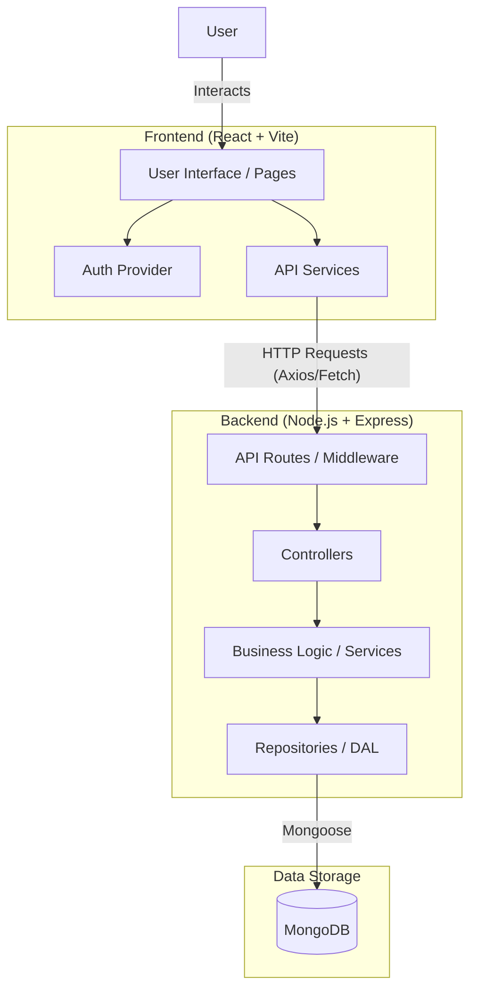
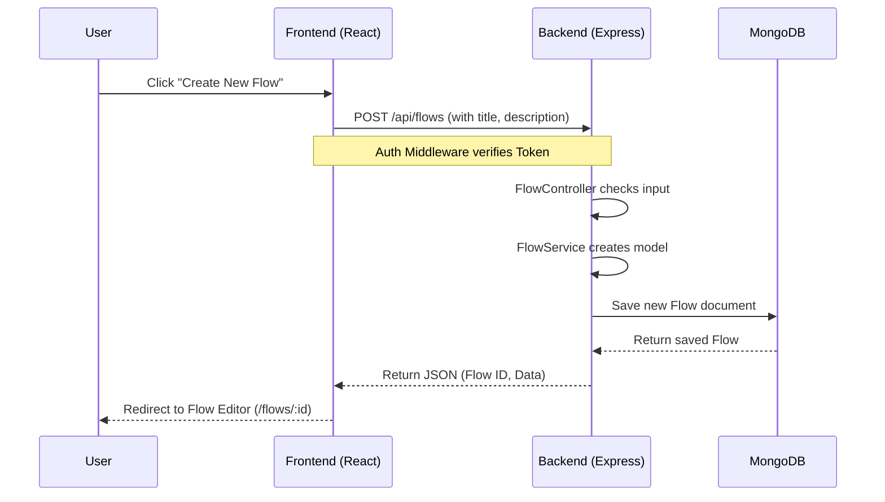

# Project Architecture & Workflow

This document outlines the architectural flow of "The Existential Choreography Planner".

## High-Level Architecture

The project follows a standard MERN (MongoDB, Express.js, React, Node.js) stack architecture.

## Detailed Workflow

### 1. User Interaction Flow
1. **Access**: User visits the web application (Landing Page).
2. **Authentication**: User logs in or registers via `/login` or `/register`.
    - Frontend sends credentials to `/api/auth/login`.
    - Backend validates and returns JWT (Access/Refresh tokens) via HttpOnly cookies.
3. **Dashboard**: Authenticated user accesses `/dashboard`.
    - Frontend checks for valid Auth Context.
    - If valid, fetches user data and flows.
    
### 2. Data Flow (Example: Creating a New Flow)

## Technology Stack Structure

### Frontend (`/frontend`)
- **Framework**: React (Vite)
- **Routing**: `react-router-dom` (App.jsx)
- **State**: Context API (`AuthProvider`)
- **API Client**: Service layer patterns (`services/`)

### Backend (`/backend`)
- **Server**: Node.js + Express (`index.js`)
- **Authentication**: Passport.js + JWT (`config/passport.js`)
- **Database**: Mongoose (`config/db.js`)
- **Structure**: Layered Architecture
    - **Routes**: Define endpoints (`routes/`)
    - **Controllers**: Handle HTTP requests (`controllers/`)
    - **Services**: Business logic (`services/`)
    - **Repositories**: Database access (`repositories/`)

## Key Directories

| Directory | Purpose |
| to | to |
| `frontend/src/pages` | React components for each route (Login, Dashboard, etc.) |
| `frontend/src/services` | API handling files (auth, flows, tasks) |
| `backend/routes` | API route definitions |
| `backend/controllers` | Request handling logic |
| `backend/models` | Mongoose schemas (User, Flow, Task) |
